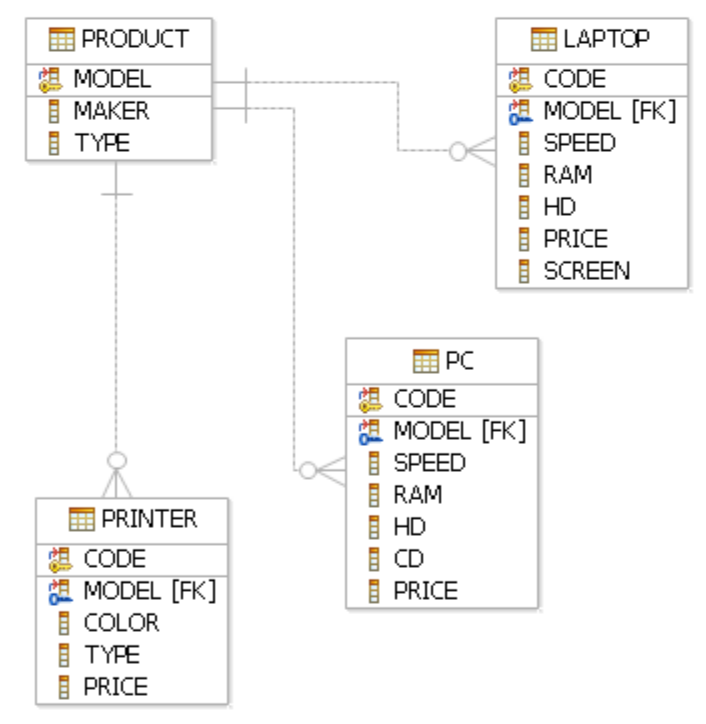

    
BG

# Тригери - задачи

<ol>
    <li>Добавете Брус Уилис в базата. Направете така, че при добавяне на филм, чието заглавие съдържа “save” или “world”, Брус save” или “save” или “world”, Брус world”, Брус Уилис автоматично да бъде добавен като актьор, играл във филма.</li>
    <li>Да се направи така, че да не е възможно средната стойност на Networth да е помалка от 500 000 (ако при промени в таблицата MovieExec тази стойност стане по-малка от 500 000, промените да бъдат отхвърлени).</li>
    <li>MS SQL не поддържа ON DELETE SET NULL. Да се реализира с тригер за външния ключ Movie.producerc#.</li>
    <li>При добавяне на нов запис в StarsIn, ако новият ред указва несъществуващ филм или актьор, да се добавят липсващите данни в съответната таблица (неизвестните данни да бъдат NULL).</li>
    <li>Да се направи така, че при изтриване на лаптоп на производител D автоматично да се добавя PC със същите параметри в таблицата с компютри. Моделът на новите компютри да бъде ‘1121’, CD устройството да бъде ‘52x’, а кодът - със 100 по-голям от кода на лаптопа.</li>
    <li>При промяна на цената на някой компютър се уверете, че няма по-евтин компютър със същата честота на процесора.</li>
    <li>Никой производител на компютри не може да произвежда и принтери.</li>
    <li>Всеки производител на компютър трябва да произвежда и лаптоп, който да има същата или по-висока честота на процесора.</li>
    <li>При промяна на данните в таблицата Laptop се уверете, че средната цена на лаптопите за всеки производител е поне 2000.</li>
    <li>Ако някой лаптоп има повече памет от някой компютър, трябва да бъде и по-скъп от него.</li>
    <li>Да приемем, че цветните матрични принтери (type = 'Matrix') са забранени за продажба. При добавяне на принтери да се игнорират цветните матрични. Ако с една заявка се добавят няколко принтера, да се добавят само тези, които не са забранени, а другите да се игнорират.</li>
    <li>Ако бъде добавен нов клас с водоизместимост по-голяма от 35000, класът да бъде добавен в таблицата, но да му се зададе водоизместимост 35000.</li>
    <li>Създайте изглед, който показва за всеки клас името му и броя кораби (евентуално 0). Направете така, че при изтриване на ред да се изтрие класът и всички негови кораби.</li>
    <li>Никой клас не може да има повече от два кораба.</li>
    <li>Кораб с повече от 9 оръдия не може да участва в битка с кораб, който е с помалко от 9 оръдия. Напишете тригер за Outcomes.</li>
    <li>Кораб, който вече е потънал, не може да участва в битка, чиято дата е след датата на потъването му. Напишете тригери за всички таблици, за които е необходимо.</li>
</ol>

    
ENG

# Views and indexes - problems

    
DATA BASES

# MOVIES

# PRODUCTS

# SHIPS

