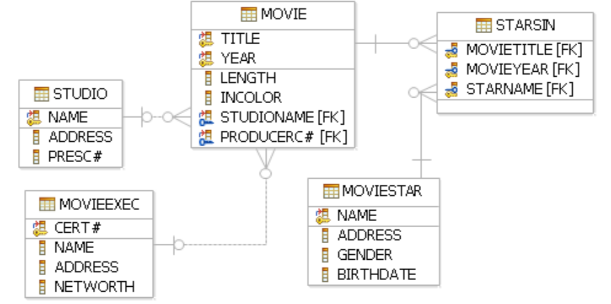

    
BG

# Задача 1

# Допълнителна задача
Имената на класовете, за които няма кораб, пуснат на вода (launched) след 1921 г. Ако за класа няма пуснат никакъв кораб, той също трябва да излезе в резултата.

    
ENG

    
DATA BASES

# MOVIES

# PRODUCTS

# SHIPS

