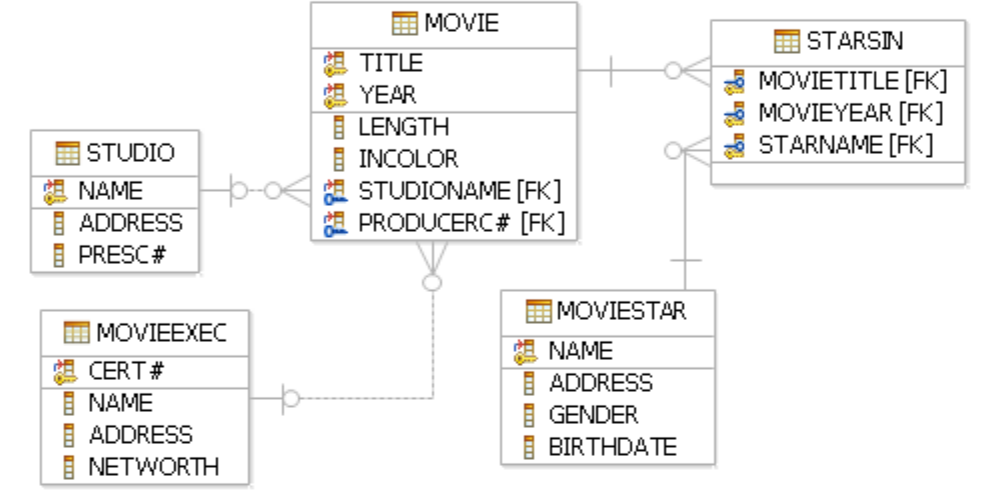
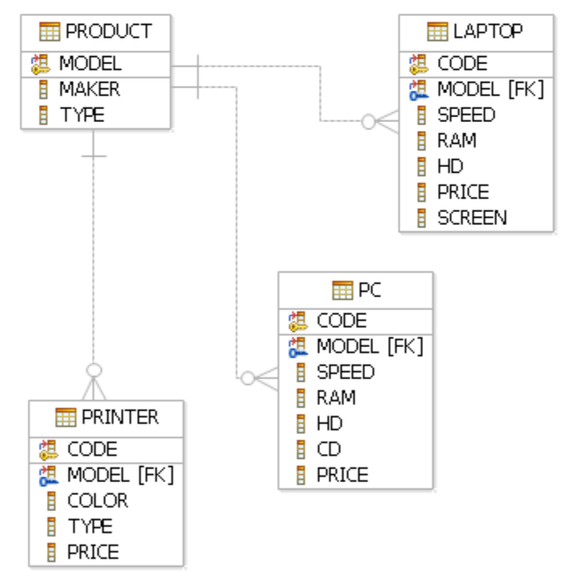
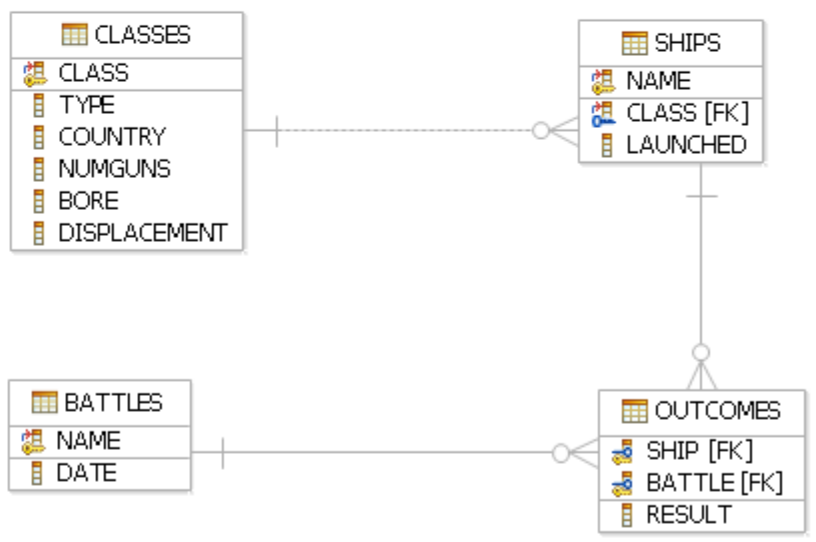

<details>
    <summary>BG</summary>

# Модификация на БД - задачи

## Ограничения - задачи Резюме:

<details>

<summary>Теория</summary>

### PRIMARY KEY
<ul>
    <li>може от един или повече атрибути</li>
    <li>не се допускат повторения</li>
    <li>не се допускат NULL стойности</li>
    <li>в една релация не може да има повече от един PK (кажи за Identity)</li>
</ul>

### UNIQUE
<ul>
    <li>може от един или повече атрибути</li>
    <li>не се допускат повторения</li>
    <li>допуска се NULL, но зависи кое СУБД ползваме</li>
    <li>в една релация може да има много UNIQUE ограничения</li>
</ul>

### FOREIGN KEY
<ul>
    <li>реферира PK в друга или същата таблица (в презентацията има пропуск)</li>
    <li>броят и типът на съставящите го атрибути трябва да съвпада с тези на PK</li>
    <li>допускат се повторения</li>
    <li>допуска се NULL</li>
    <li>в една релация може да има много FK</li>
</ul>

NOT NULL

CHECK
</details>

<details>

<summary>Задача 1</summary>

<ol>
    <li>Да се направи така, че да не може два филма да имат еднаква дължина.<br>
    ```
    alter table movie add constraint unique_length unique(length); 
    ```<br>
    Горното няма да работи, ако вече има два филма с еднаква дължина</li>
    <li>Да се направи така, че да не може едно студио да има два филма с еднаква дължина</li>
</ol>

</details>

<details>

<summary>Задача 2</summary>

Изтрийте ограниченията от първа задача от Movie.

</details>

<details>

<summary>Задача 3</summary>

За всеки студент се съхранява следната информация (за всички атрибути задължително трябва да има зададена стойност, т.е. не може NULL):
<ul>
    <li>фак. номер - от 0 до 99999, първичен ключ;</li>
    <li>име - до 100 символа;</li>
    <li>ЕГН - точно 10 символа, уникално;</li>
    <li>e-mail - до 100 символа, уникален;</li>
    <li>рождена дата;</li>
    <li>дата на приемане в университета - трябва да бъде поне 18 години след рождената;</li>
</ul>

<ol>     
    <li>добавете валидация за e-mail адреса - да бъде във формат <нещо>@<нещо>.<нещо></li>
    <li>създайте таблица за университетски курсове - уникален номер и име</li>
</ol>

Всеки студент може да се запише в много курсове и във всеки курс може да има записани много студенти. При изтриване на даден курс автоматично да се отписват всички студенти от него.

</details>

<details>

<summary>Задача 4</summary>

Създайте нова база от данни с име test.
Дефинирайте следните релации:
<ul>
    <li>Product(maker, model, type), където моделът е низ от точно 4 символа, maker - един символ, а type - низ до 7 символа</li>
    <li>Printer(code, model, color, price), където code е цяло число, color е 'y' или 'n' и по подразбиране е 'n', price - цена с точност до два знака след десетичната запетая</li>
    <li>Classes(class, type), където class е до 50 символа, а type може да бъде 'bb' или 'bc'</li>
</ul>

<ol>
    <li>Добавете кортежи с примерни данни към новосъздадените релации. Добавете информация за принтер, за когото знаем само кода и модела.</li>
    <li>Добавете към Classes атрибут bore - число с плаваща запетая.</li>
    <li>Напишете заявка, която премахва атрибута price от Printer.</li>
    <li>Изтрийте всички таблици, които сте създали в това упражнение.</li>
    <li>Изтрийте базата test</li>
</ol>

</details>

</details>

<details>
    <summary>ENG</summary>

# Modification of DB - problems

</details>

<details>
    <summary>DATA BASES</summary>

# MOVIES


# PRODUCTS


# SHIPS


</details>